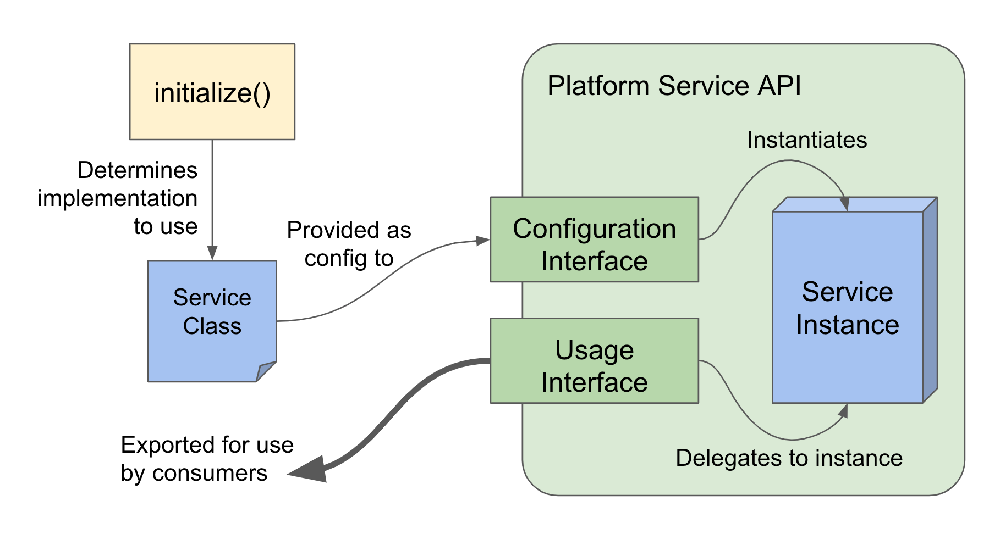

# frontend-platform

## Overview

frontend-platform is a modest application framework for Open edX micro-frontend applications and their supporting libraries. It provides a number of foundational services that all Open edX micro-frontends should have:

- Analytics
- Logging
- Authenticated API client (auth)
- Internationalization (i18n)

In addition, frontend-platform provides an extensible application initialization lifecycle to help manage the configuration of the above services, freeing application developers to focus on feature development.

## Architecture

The four foundational services listed above (analytics, auth, i18n, and logging) are provided as imports to applications via frontend-platform's API layer.  The initialization sequence creates an instance of each service and exposes its methods as functional exports, creating a layer of abstraction between service implementations and their usage in application code.

Each type of service has a documented API contract which service implementations must fulfill. This allows different service implementations to be used as necessary without updates to consuming applications.

### Application Initialization

frontend-platform provides an `initialize()` function which bootstraps and configures an application.  The `initialize()` function uses a set of [sensible defaults](https://en.wikipedia.org/wiki/Convention_over_configuration) unless otherwise specified, bootstrapping the application with services reflecting Open edX's best practices around analytics, authentication, internationalization, and logging.

The initialization process proceeds in a series of phases, giving the initializing application code opportunities to hook into the process and do custom setup as desired:

- Before initialization
- Pub/Sub initialized
- Environment config document loaded
- Logging service initialized
- Authentication service initialized
- Analytics service initialized
- Internationalization service initialized
- Application ready

Most applications won't need to do anything special at all.

### Service interfaces

Each service (analytics, auth, i18n, logging) provided by frontend-platform has a API contract which all implementations of that service are guaranteed to fulfill.  Applications that use frontend-platform can use its configured services via a convenient set of exported functions.  An application that wants to use the service interfaces need only initialize them via the initialize() function, optionally providing custom service interfaces as desired (you probably won't need to).

### Service implementations

This repository contains default service implementations for convenience.  These implementations are co-located with their consuming service interfaces for ease of development, though the two should remain _strictly_ modular and separate.

The included service implementations are:

- New Relic (logging)
- Segment (analytics)
- Axios/JWT (auth)
- React Intl (i18n)

NOTE: As of this writing, both authentication and i18n are _not_ configurable.  The `initialize()` function does not allow applications to supply alternate auth/i18n implementations; this is because the interface and implementations for auth and i18n have not yet been separated and modularized.
